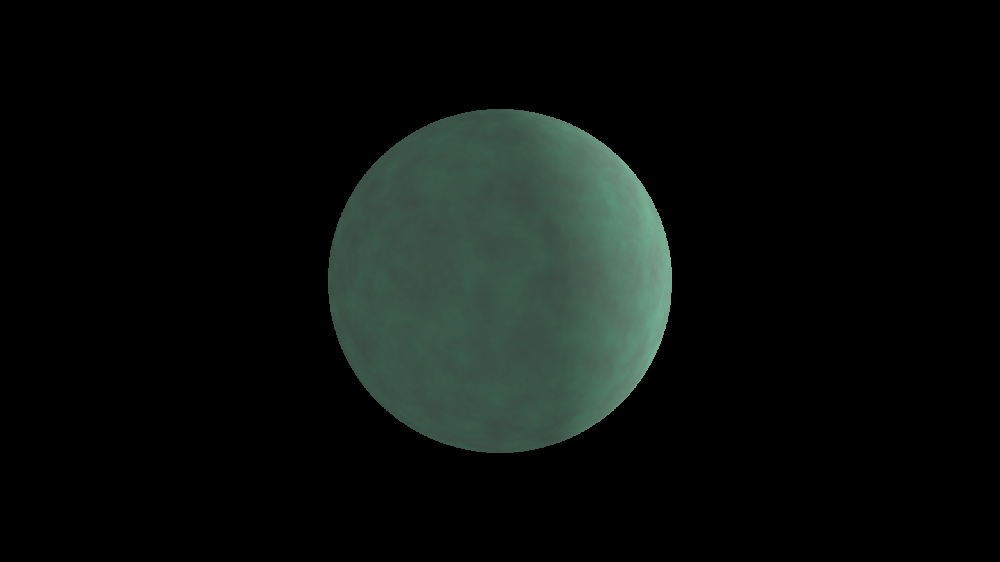

# Planetary Viewer

## Description

This is a basic 3D visualization program that displays a sphere with a randomly generated textured surface. It includes rudimentary day/night cycle effects and allows for camera movement around the sphere.



## Features

- Computer-generated planet texture
- Day/night cycle simulation
- Two camera modes: orbit and free movement
- Basic collision detection
- Configurable parameters

## Requirements

- Python 3.7+
- PyOpenGL
- Pygame
- NumPy
- Pillow
- noise

## Installation

1. Clone the repository:
   ```
   git clone https://github.com/cathodeDreams/planetary-viewer.git
   ```

2. Install the required dependencies:
   ```
   pip install -r requirements.txt
   ```

## Usage

Run the application using:

```
python main.py
```

### Controls

- Mouse movement: Rotate camera
- Mouse wheel: Zoom in/out
- W/A/S/D: Move camera (in free mode)
- E/Q: Move camera up/down (in free mode)
- Space: Toggle between orbit and free camera modes
- Shift: Boost camera movement speed (in free mode)
- Esc: Exit the application

## Configuration

Adjust the `config.py` file to modify various parameters such as window size, planet radius, texture resolution, and camera settings.

## License

This project is licensed under the GNU General Public License v3.0
